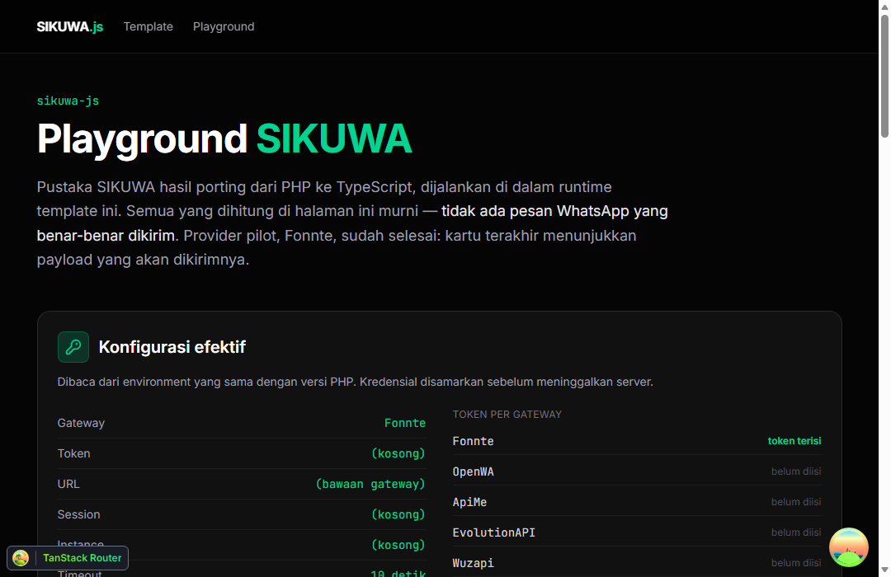
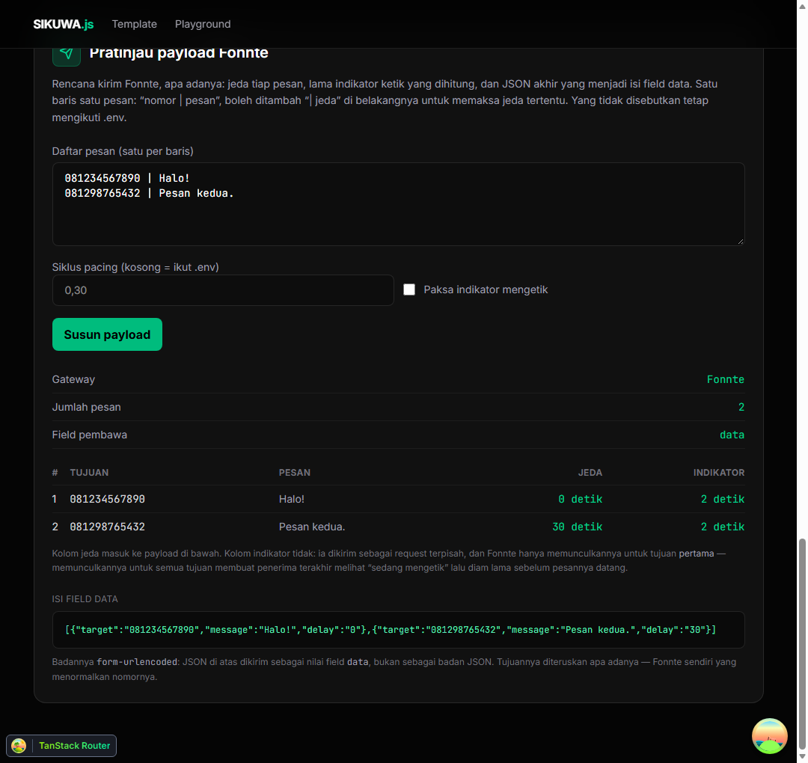

<div align="center">

# sikuwa

**SDK multi-gateway WhatsApp untuk JavaScript/TypeScript** — satu antarmuka untuk
tujuh gateway, porting dari paket PHP
[`mdestafadilah/sikuwa`](https://github.com/mdestafadilah/sikuwa).

**Tanpa dependensi runtime.** Seluruh gateway hanya REST + JSON, jadi `fetch`
bawaan Node 18+, Bun, Cloudflare Workers, dan peramban sudah cukup.

[](https://www.npmjs.com/package/sikuwa)
[](LICENSE)
[](https://www.typescriptlang.org/)



</div>

## Pasang

```bash
npm install sikuwa
# atau
bun add sikuwa
```

Paket ini **ESM saja**. Node 18+ sudah punya `fetch` global yang dibutuhkan;
Node 22.12+ bahkan bisa `require("sikuwa")` dari proyek CommonJS. Tidak ada
dependensi yang ikut terpasang — `npm ls sikuwa` hanya akan menampilkan satu
baris.

## Pakai

```ts
import { Fonnte } from "sikuwa";

// Membaca WHATSAPP_* dari process.env.
const fonnte = new Fonnte();

// Satu pesan.
await fonnte.sendMessage({
  destination: "081234567890",
  message: "Halo dari sikuwa!",
});

// Beberapa sekaligus, dengan jeda yang diatur sendiri.
await fonnte.sendMessage([
  { destination: "081234567890", message: "Pesan pertama." },
  { destination: "081298765432", message: "Pesan kedua.", delay: 30 },
]);
```

Konfigurasi bisa juga diberikan langsung, tanpa environment sama sekali:

```ts
import { Config, Fonnte } from "sikuwa";

const config = new Config({
  tokens: { Fonnte: "token-fonnte" },
  pacing: { cycle: "0,30" },
  typing: { enabled: true },
});

const fonnte = new Fonnte(config);
```

Kunci environment sengaja dipertahankan **persis sama** dengan versi PHP, supaya
berkas `.env` yang sudah ada tetap terbaca:

```dotenv
WHATSAPP_PROVIDER=Fonnte
WHATSAPP_TOKEN_Fonnte=xxxxxxxxxxxx
WHATSAPP_PACING_CYCLE=0,30
WHATSAPP_TYPING=1
WHATSAPP_THROTTLE_MAX=20
WHATSAPP_THROTTLE_WINDOW=60
```

Daftar lengkapnya ada di [`.env.example`](.env.example).

## Gateway yang didukung

| Gateway | Jenis | Basis | Tautan |
| --- | --- | --- | --- |
| Fonnte | Berbayar (cloud) | — | <https://fonnte.com/> |
| OpenWA | Self-hosted | Node.js | <https://github.com/rmyndharis/OpenWA> |
| ApiMe | Self-hosted | Go / WhatsMeow | <https://github.com/open-apime/apime> |
| Evolution API | Self-hosted | Node.js / Baileys | <https://github.com/evolution-foundation/evolution-api> |
| Wuzapi | Self-hosted | Go / WhatsMeow | <https://github.com/asternic/wuzapi> |
| Wwebjs | Self-hosted | Node.js / whatsapp-web.js | <https://github.com/avoylenko/wwebjs-api> |
| Waxum | Self-hosted | Rust / whatsapp-rust | <https://github.com/imtaqin/waxum> |

Ketujuhnya memakai bentuk pesan yang sama (`destination` + `message`), jadi
mengganti gateway tidak mengubah kode pemanggil. Yang berbeda hanya kredensial,
id sesi, dan kunci `.env`-nya.

## Status porting

Ini **porting, bukan konversi**: paket PHP tetap sumber kebenaran, dan versi npm
adalah implementasi kedua. Karena itu cakupannya bertahap — dan versinya
sengaja dimulai dari `0.1.0`, bukan mengikuti `0.7.3` milik paket PHP, supaya
tidak terkesan sudah setara padahal belum.

| Lapisan | Status |
| --- | --- |
| Support (Pacing, Throttle, Typing, Presence, PhoneNumber, Text, File, Envelope, Qr) | selesai |
| Exceptions (14 kelas), Config, Session, Contracts | selesai |
| Http (HttpResponse, HttpExecutor berbasis `fetch`) | selesai |
| AbstractProvider (plan, retry, pacing, typing, jalur kirim berurutan) | selesai |
| **Fonnte**, **OpenWA**, **ApiMe** | **selesai** |
| EvolutionAPI, Wuzapi, Wwebjs, Waxum | belum |
| Client (registri provider, pemilihan `auto`, `notify()`) | belum |

Sampai `Client` selesai, provider dibuat langsung seperti contoh di atas.
Mengganti gateway nanti tidak mengubah kode pemanggil, karena seluruh provider
memakai bentuk pesan yang sama.

## Perbedaan yang disengaja dari versi PHP

- **Setiap panggilan jaringan mengembalikan `Promise`.** PHP memblokir di dalam
  pemanggilan; JavaScript tidak bisa.
- **`File.bytes()` mengembalikan `Uint8Array`**, bukan string biner — bentuk
  yang memang diminta `Blob`/`FormData` di jalur unggah.
- **Accessor konfigurasi provider bernama `settings()`, bukan `config()`.** PHP
  membedakan properti `$this->config` dari method `$this->config()`; JavaScript
  tidak bisa, dan properti `config` dipertahankan apa adanya karena setiap
  provider membacanya jauh lebih sering.

Selain tiga itu, perilakunya dijaga setia — termasuk detail semantik PHP yang
mudah terlewat (`is_numeric(true) === false`, `"0"` dianggap salah oleh
`filter_var`, `rtrim($url, '/')` membuang semua garis miring, dan seterusnya).

## Pengembangan

```bash
bun install
bun test              # 345 tes paritas + integrasi
bun run typecheck     # app, worker, dan pustaka
bun run build:lib     # keluaran npm ke dist-lib/
bun run dev           # playground di http://localhost:5173
```

Paritas perilaku dibuktikan lewat tes, bukan diklaim: berkas PHPUnit di repo PHP
diterjemahkan menjadi `tests/sikuwa/**/*.test.ts`. Fonnte juga diuji terhadap
server HTTP sungguhan (`fonnte-live.test.ts`) — klien tiruan tidak bisa
membuktikan bahwa `URLSearchParams`, `boundary` multipart, dan byte berkas
benar-benar utuh setelah melewati `fetch` bawaan.

### Playground

`src/api/whatsapp/` + `src/routes/whatsapp.tsx` menyediakan halaman untuk
memeriksa konfigurasi, perhitungan pacing/typing/throttle, dan **payload yang
akan dikirim** — semuanya tanpa mengirim satu pesan pun. Pratinjau payload
memakai klien HTTP yang sengaja selalu gagal, jadi kalau jalur itu tanpa sengaja
menyentuh jaringan, halamannya gagal alih-alih benar-benar menembak gateway.



### Struktur

```
src/lib/sikuwa/          pustaka (tanpa dependensi runtime)
  internal/scalar.ts     semantik tipe longgar PHP (is_numeric, FILTER_VALIDATE_BOOLEAN, …)
  support/               modul murni: pacing, throttle, typing, presence, file, …
  http/                  transport berbasis fetch yang bisa disuntik
  exceptions/            seluruh kelas exception
  config.ts, session.ts
  contracts/whatsapp.ts  antarmuka yang harus dipenuhi setiap gateway
  providers/             AbstractProvider + tiap gateway (fonnte/, openwa/, apime/)
  index.ts               permukaan publik
src/api/whatsapp/        playground Hono (service → controller → route)
src/routes/whatsapp.tsx  halaman playground
tests/sikuwa/            suite tes paritas
scripts/build-lib.mjs    build paket npm (tsc + ekstensi .js)
```

---

Repositori ini dibangun di atas **BHVR Template** (Bun + Hono + Vite + React +
Cloudflare Workers). Dokumentasi template-nya ada di
[BHVR-TEMPLATE.md](BHVR-TEMPLATE.md).
